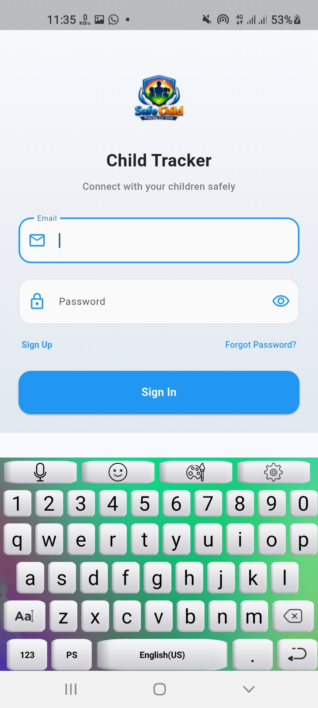
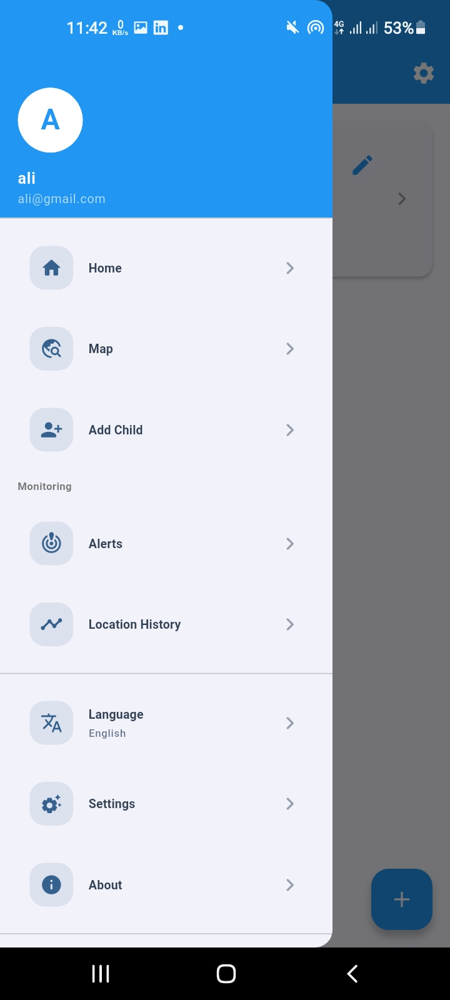
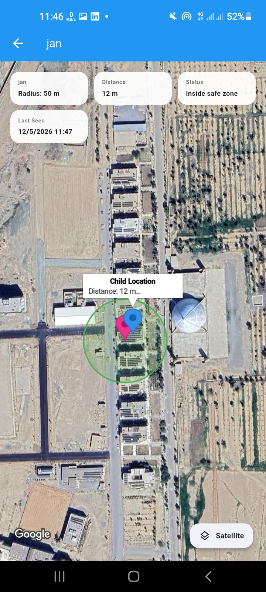
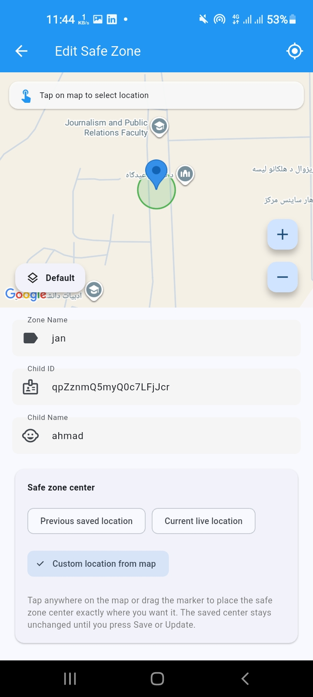
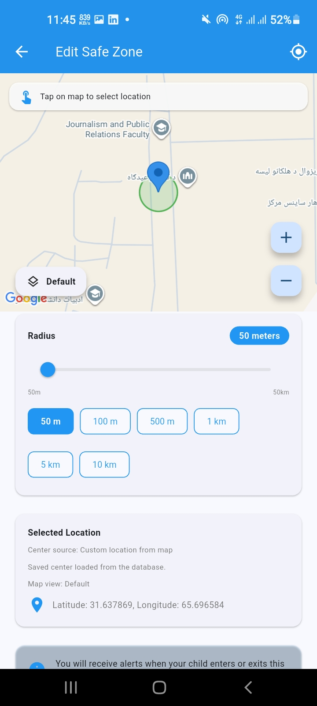
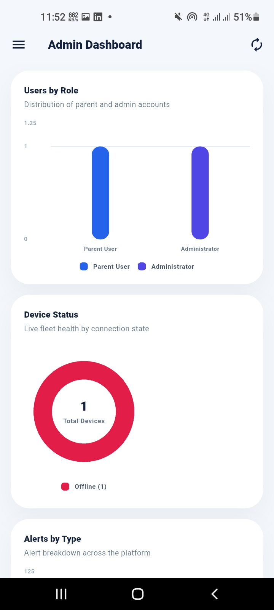
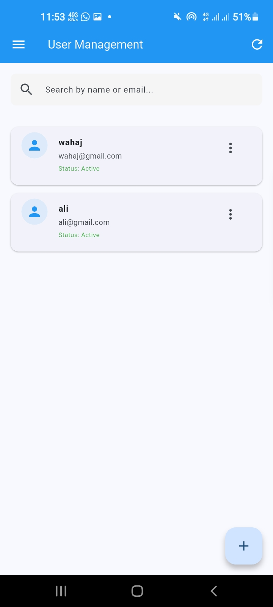
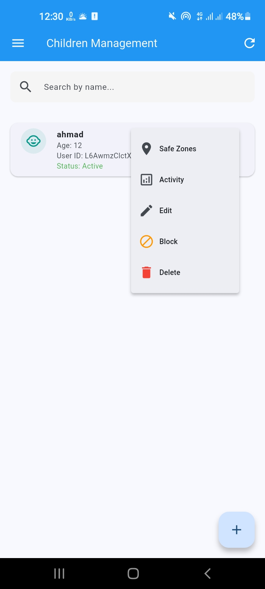
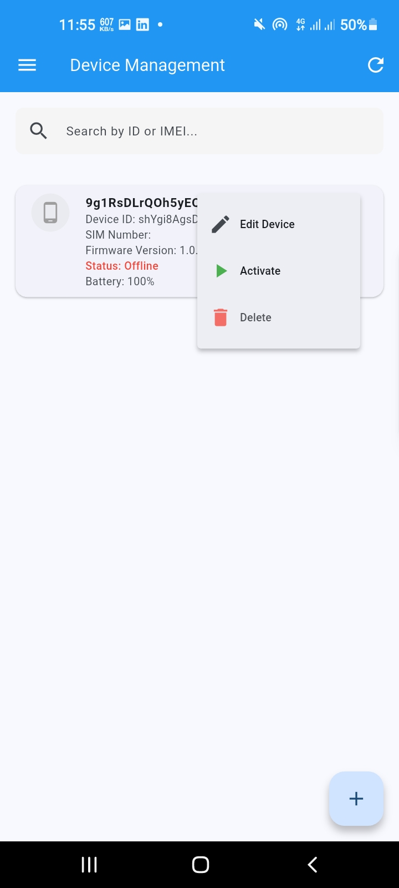
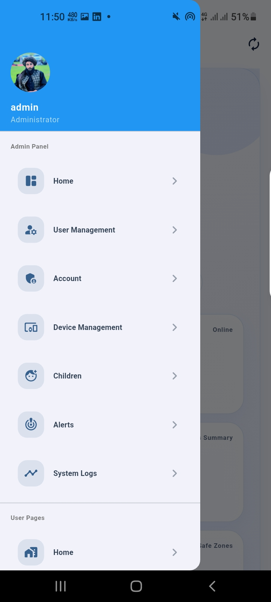

<<<<<<< HEAD
# Child Safety GPS Tracking System

A modern, mobile-responsive **Child Safety, GPS Tracking, Safe Zone, Alert, Reporting, and Administration System** built with a Flutter frontend and a Node.js/Firebase backend.

This system is designed to help parents, guardians, and administrators monitor children, manage tracking devices, view live locations, define safe zones, receive alerts, and review activity history through one centralized digital platform.

---

## About The Project

The **Child Safety GPS Tracking System** is a practical location monitoring and safety management application focused on real-time child tracking, emergency alerts, geofence monitoring, device management, and multilingual access.

The platform combines a cross-platform Flutter app with a secure Express.js backend and Firebase services for live data, authentication, notifications, storage, and system monitoring.

---

## Project Overview

| Item | Details |
|------|---------|
| **Project Name** | Child Safety GPS Tracking System |
| **App Name** | Child Tracker |
| **Project Type** | Mobile, Web, and Backend Management System |
| **Client / Industry** | Child Safety / Family Safety / Location Tracking |
| **Main Purpose** | Real-time GPS tracking, safe zone monitoring, alerts, and administration |
| **Frontend** | Flutter / Dart |
| **Backend** | Node.js / Express.js |
| **Database & Cloud Services** | Firebase Firestore, Realtime Database, Authentication, Cloud Messaging, and Storage |
| **Repository** | [View Repository](https://github.com/abdulwahabwahaj/Final-Year-Project3) |
| **Demo Link** | Coming Soon |

---

## Problem

Parents and guardians need a reliable way to monitor child safety, track real-time movement, and respond quickly when something unusual happens.

Manual tracking and disconnected communication create several challenges:

- Child location is difficult to monitor in real time
- Safe zones such as home, school, or family areas are hard to enforce manually
- Emergency alerts may not reach guardians quickly enough
- Location history and route movement are difficult to review
- Device status, battery state, and connectivity are hard to manage
- Administrators need a central system to manage users, children, devices, and alerts
- Multilingual users need an interface that supports local language needs

---

## Solution

This project provides a complete digital platform for child safety and GPS tracking.

The system allows users to register, manage child profiles, connect tracking devices, view live locations on Google Maps, create safe zones, receive SOS and geofence alerts, review location history, and manage notification preferences.

The backend supports authentication, location updates, alert processing, geofence monitoring, device status tracking, OTP email verification, audit logs, and admin-level management. The Flutter frontend provides a clean interface for parents and administrators across mobile, web, and desktop targets.

---

## Key Features

- Secure login and registration system
- OTP verification and password reset support
- Parent dashboard and child management
- Admin dashboard with system statistics
- User, child, admin, and device management
- Real-time GPS location tracking
- Google Maps integration
- Location history and route tracking
- Safe zone and geofence management
- Automatic safe zone entry and exit monitoring
- SOS emergency alert support
- Low battery and offline device alerts
- Push and local notification support
- Device registration, activation, and status tracking
- Activity logs and audit tracking
- Profile photo and child image upload support
- Settings and notification preference management
- English, Pashto, and Dari/Persian localization
- RTL interface support for Pashto and Dari/Persian
- Mobile-responsive and web-ready Flutter interface

---

## Technologies Used

- Flutter
- Dart
- Provider
- Google Maps
- Node.js
- Express.js
- Firebase Admin SDK
- Firebase Authentication
- Cloud Firestore
- Firebase Realtime Database
- Firebase Cloud Messaging
- Firebase Storage
- Nodemailer
- bcrypt
- dotenv
- CORS
- GitHub

---

## Project Structure

```text
Final-Year-Project3/
|-- child_tracker/          # Flutter frontend application
|   |-- lib/
|   |   |-- models/         # App data models
|   |   |-- providers/      # State management providers
|   |   |-- screens/        # User and admin screens
|   |   |-- services/       # API, Firebase, tracking, and notification services
|   |   |-- utils/          # Constants and helper utilities
|   |   `-- widgets/        # Shared UI widgets
|-- controllers/            # Express controller logic
|-- routes/                 # Backend API routes
|-- middleware/             # Auth, logging, and error middleware
|-- services/               # Backend service helpers
|-- utils/                  # Backend tracking, notification, and sync utilities
|-- server.js               # Backend entry point
|-- package.json            # Backend dependencies and scripts
`-- README.md
```

---

## Backend Setup

1. Install backend dependencies:

```bash
npm install
```

2. Create your environment file:

```bash
cp .env.example .env
```

3. Update `.env` with your Firebase, email, and security configuration.

4. Start the backend server:

```bash
npm start
```

The backend runs on:

```text
http://localhost:3000
```

---

## Flutter Frontend Setup

1. Move into the Flutter app:

```bash
cd child_tracker
```

2. Install Flutter dependencies:

```bash
flutter pub get
```

3. Run the app:

```bash
flutter run
```

For a physical Android phone, provide your computer IP address so the app can reach the backend:

```bash
flutter run --dart-define=API_BASE_URL=http://YOUR_COMPUTER_IP:3000/api
```

---

## Main Backend API Areas

- `/api/users` - user registration, login, profile, and account management
- `/api/children` - child profile management
- `/api/devices` - tracking device registration and status management
- `/api/locations` - live location, history, and route data
- `/api/alerts` - alerts and SOS events
- `/api/geofence` - safe zones and geofence checks
- `/api/activity` - activity records
- `/api/summary` - dashboard and summary data
- `/api/settings` - user and system settings
- `/api/admin` - admin dashboard, users, devices, children, alerts, and logs

---

## Screenshots

| Login Page | User Dashboard | Child Information & Location |
|------------|----------------|------------------------------|
|  |  |  |

| Child Location & Safe Zone | Edit Safe Zone | Edit Safe Zone Map |
|----------------------------|----------------|--------------------|
|  |  |  |

| Admin Dashboard | Admin Graphs | User Management |
|-----------------|--------------|-----------------|
|  |  |  |

| Child Management | Device Management | Admin Overview |
|------------------|-------------------|----------------|
|  |  |  |

---

## Result

The system provides a centralized platform for managing child safety, GPS tracking, safe zones, emergency alerts, device status, activity logs, and administration.

It improves:

- Child location visibility
- Emergency response awareness
- Safe zone monitoring
- Device and user management
- Location history review
- Parent and administrator coordination
- Multilingual accessibility
- Mobile and web access

---

## Project Status

The project is under active development. The main frontend and backend structure is available, with live tracking, alerts, geofencing, admin tools, Firebase integration, and multilingual interface support already included.

Further improvements, deployment setup, production security hardening, and public demo access can be added over time.

---

## Developed By

**Child Tracker Development Team**  
Final Year Project

---

## License

This project is currently marked as **ISC** in `package.json`.
=======
# Child-Safety-Tracking-System
The Child Safety Tracking System is a  application designed to help parents and guardians monitor and protect children. The system provides real-time GPS tracking, location history, geofencing with instant notifications, SOS emergency alerts, and secure communication features.
>>>>>>> 9c8228abce59f1066c626f03c3fb1f297f2b946f
